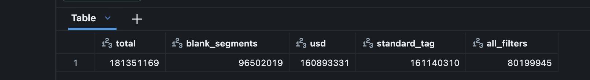

# Decisions & Findings

## Phase 0 — Viability

### The segments bug (2026-08-16)
First diff of 2022q1 vs 2024q1 showed 51.2% of facts materially changed.
Implausible — real restatement rates are low single digits.

Diagnostic: balance-sheet instants (qtrs=0) changed at 77.1% vs quarterly
durations at 12.2%. No economic mechanism explains that gap. 2,179 sign
flips out of 10,259 overlapping keys.

Root cause: `segments` was omitted from the natural key, so consolidated
totals collided with per-segment breakdowns. drop_duplicates() then picked
arbitrarily between them.

Fix: `segments` is part of the natural key. Consolidated series requires
blank segments AND blank coreg.
Result: 51.2% -> 5.97%; sign flips 2,179 -> 78.

Why it mattered: segment tagging has grown from 44% (2013) to 60% (2026)
of all facts, so the bug's severity increased over time. Uncorrected, it
would have produced a spurious upward trend in restatement rates — a
plausible-looking but entirely false finding.

### Ground truth fixtures
- AT&T (CIK 732717) FY2021 Revenues: $168.9B -> $134.0B (WarnerMedia
  separation, discontinued ops). Verified against both filings.
- Zillow (CIK 1617640) FY2021 OperatingIncomeLoss: -$327.7M -> +$239.0M.
  Sign crosses zero but this is REAL economics, not a presentation artefact.
  Classifier must not discard it as SIGN_FLIP.

### The 5.97% is not the population rate
Overlap sample is biased: ddate concentrated in 2020-21. Periods appearing
in filings two years apart are disproportionately late re-reports.
Population rate comes from Phase 4 over all 69 quarters.

## Phase 1 — Acquisition

### Scale
69 quarters, 181,351,169 facts, 426,003 submissions, 5.58 GB. Zero failures.

### XBRL phase-in coverage cliff
Facts/quarter: 3,999 (2009q2) -> 2.0M (2011q3) -> ~3.5M plateau.
Reflects the SEC's phased mandate (large accelerated filers 2009, all
filers by mid-2011). Pre-2011 data is NOT comparable to later periods.
Phase 4 experiment window should start 2012 or later.

2009q1 is a headers-only placeholder (0 rows). Expected, not a failure.

### Schema is stable
num.txt has the same 10 columns across 2013-2026. Checked 2013q1, 2020q1,
2025q1, 2025q4, 2026q1. rescuedDataColumn retained as insurance only.

### Filer count decline
Submissions peaked ~9,200 (2012q2), now ~6,200. Real trend — shrinking
count of US public companies. Not a data quality issue.

### Concept mapping recovered 32 points of revenue coverage
Bare tag `Revenues`: 37.1% of filings. After mapping four ASC 606-era
source tags to canonical REVENUE: 69%. A naive tag filter would have
dropped ~1/3 of filings, with the loss concentrated pre-2018 — a
time-correlated coverage discontinuity in the middle of the backtest window.

### COST_OF_REVENUE coverage is structurally limited
45% overall = 7.4% financials (SIC 6000-6799) + 57% non-financials.
Financials have no cost-of-goods concept. Not a mapping gap.

### Phase 4 factor: ROA, not gross profitability
NET_INCOME (90%) / ASSETS (98%) vs COST_OF_REVENUE (45%). The factor is
instrumentation for measuring naive-vs-PIT disagreement; unstable coverage
would conflate universe churn with restatement contamination. ROA also
retains financials, keeping the universe whole.

## Phase 2 — Silver

### Funnel: 181.4M -> 45.1M (24.9%)
- Segment-level facts:        ~84.8M  (largest single exclusion)
- Below concept-map threshold: ~35M   (tags in <5% of filings)
- Non-USD / custom tags:       ~16M
- Quarantined (broken):          2.2k (0.0012%)

### Quarantine vs exclusion

Quarantine = data that is broken. Exclusion = valid data out of scope.
First attempt conflated them: qtrs 2/3 (semi-annual, nine-month cumulative)
were being quarantined as failures, putting 33.8M rows in quarantine and
making the metric useless. Moving them to scope-exclusion dropped quarantine
to 2.2k, which is now low enough to alert on.

### Source data quality is high

Only 12 uncastable values in 181M rows. 1,987 implausible ddates (pre-1990).
Zero unparseable acceptance timestamps across 426k submissions -- important,
since accepted_ts is the transaction-time axis for the entire warehouse.

## Phase 3 — Bitemporal core

### Precedence logic extracted as pure functions
src/hindsight/precedence.py has no Spark or dlt dependency, so the six
precedence rules are testable against hand-built fixtures in 2 seconds
rather than a pipeline run over 45M rows.

26 tests, including two real-data regressions (AT&T FY2021 revenue,
Zillow FY2021 operating income) verified against filings on EDGAR.

### P3 is satisfied structurally, not by code
"An amendment does not retract facts it does not mention" needs no
implementation: each natural key gets an independent timeline, so a fact
absent from an amendment simply has no new entry and its interval continues.

### SIGN_FLIP rule tightened after Zillow
Original spec treated any sign reversal as a presentation artefact. Zillow
FY2021 OperatingIncomeLoss went -327.7M -> +239.0M: sign flips, but this is
the Zillow Offers wind-down -- real economics. Rule now requires magnitude
preserved within 2% for a sign reversal to count as an artefact. Encoded as
a regression test.

### pytest on Workspace filesystem
__pycache__ creation fails with OSError 95 (operation not supported). Needs
PYTHONDONTWRITEBYTECODE=1 and -p no:cacheprovider. Workspace-specific — do
NOT carry into the GitHub Actions workflow.