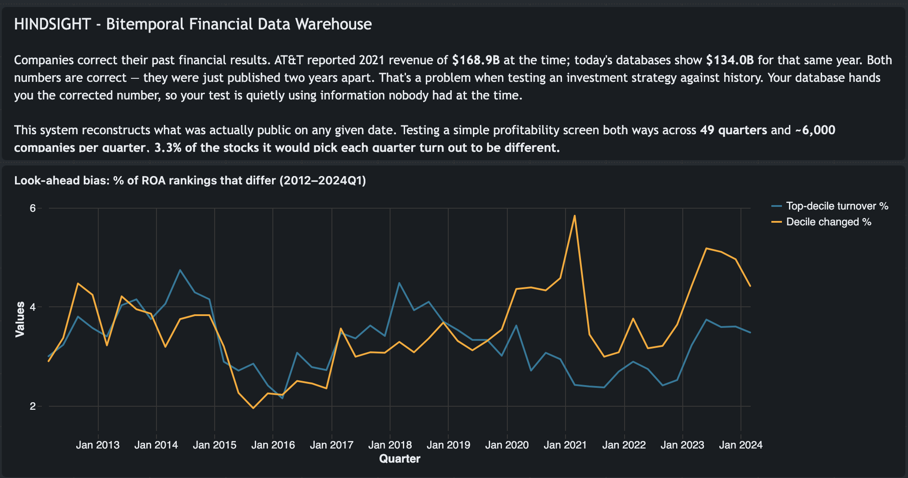
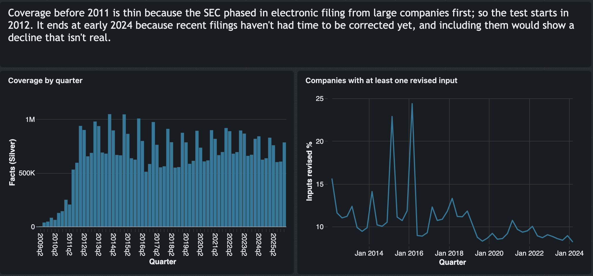

# Hindsight

**A financial data warehouse that remembers what people knew, and when they knew it.**

Built on Databricks over 69 quarters of SEC filings. 181 million facts, reconstructed into
21.8 million knowledge intervals covering 14,885 US public companies.

---

## The problem

In February 2022, AT&T told the SEC its 2021 revenue was **$168.9 billion**. That was the
number everyone had.

A year later AT&T filed again and said 2021 revenue was **$134.0 billion**.

Nobody lied. AT&T spun off WarnerMedia in April 2022, and accounting rules require restating
prior years as if the spun-off business had never been part of the company. The $35 billion
difference is WarnerMedia being removed from history.

The catch: **every financial database today shows $134.0B for 2021.** The original number is
gone, overwritten by the correction.

## Why that breaks things

Say you have an idea for picking stocks, like buying the most profitable companies each quarter,
and you want to know if it would have worked. So you test it against the past.

The numbers you look up aren't the ones that existed back then. They're the corrected versions,
some fixed years later. Your test isn't asking "what would I have picked?" It's asking "what
would I have picked if I could see two years into the future?"

It doesn't cancel out either. Companies correct their numbers when something was off, which
means the corrected ones are disproportionately the ones that stand out in a profitability
ranking. Your test gets to peek at exactly the names it's most likely to pick.

The finance term is **look-ahead bias**. It's why Compustat and FactSet sell separate,
expensive "point-in-time" products. This builds a free one from public SEC data.

## What this does

It stores every reported number twice over: once for the period it describes, once for the
window when it was the public number.

AT&T's 2021 revenue isn't one row. It's two:

| Value | Public from | Until |
|---|---|---|
| $168,864,000,000 | 2022-02-16 06:30 | 2023-02-13 16:12 |
| $134,038,000,000 | 2023-02-13 16:12 | still current |

Ask what AT&T's 2021 revenue was, and you get $134.0B.
Ask what it was **as of June 2022**, and you get $168.9B.
Ask about January 2022 and you get **nothing**, because the annual report hadn't been filed yet.

That last one matters most. "Not yet known" has to stay empty. Filling it with a zero or with
the eventual value is how future information leaks into a backtest.

## The finding

I tested a simple rule: each quarter, rank every US public company by return on assets and take
the top 10%. Ran it twice, once with today's corrected numbers and once with only what was
public on each date, then compared the lists.

Across **49 quarters** (2012 to 2024) and **~6,000 companies per quarter**:

| | |
|---|---|
| Companies with at least one corrected input | **10.8%** |
| Companies landing in a different decile | **3.6%** |
| **Stocks in the "buy" list that differ** | **3.3%** |

Out of roughly 600 stocks picked each quarter, about **20 are picks the strategy wouldn't
actually have made.**

**On the size of it:** 3.3% is real and consistent but modest. It won't turn a winning strategy
into a losing one by itself. It's a steady distortion in exactly the slice a strategy trades on,
invisible unless you build something like this.

**And it's a floor.** Both arms used the same companies and the same fiscal periods, so only the
values differed. A real naive backtest also gets the timing wrong, assuming annual results are
available on the last day of the fiscal year when the filing doesn't land for another two
months. That isn't measured here, so true total bias is larger.

---

## Three times the data nearly told me something false

The hard part wasn't the pipeline. It was that plausible findings kept turning out to be
artifacts.

**1. "Half of all financial facts get restated."**

My first measurement said 51%. Real rates are a few percent, so something was wrong. The
diagnostic showed balance-sheet figures changing at 77% against quarterly figures at 12%, a gap
with no economic explanation, plus 2,179 impossible sign reversals.

SEC data has a `segments` column marking whether a number is a company-wide total or a
breakdown by business unit. I'd left it out of the key, so consolidated equity was being
compared against treasury stock line items. Adding it: 51% to 6%, sign flips 2,179 to 78.

The bug would have gotten worse over time, since segment tagging grew from 44% of facts in 2013
to 60% in 2026. Left in, it would have produced a clean upward trend in restatement rates
through the 2010s. That looks like a finding. It would have been manufactured.

**2. "Revenue data only covers 37% of companies."**

"Revenue" isn't one tag. A 2018 accounting change split it across four, and companies use
different ones depending on when they filed. Filtering on the obvious one drops two-thirds of
the market, and drops more before 2018 than after, putting a coverage cliff in the middle of the
test window. A mapping layer took coverage to 69%.

**3. "Restatements have been declining since 2024."**

They haven't. A filing from 2025 has had a few months for a correction to arrive; one from 2012
has had fourteen years. Recent periods look clean because not enough time has passed. The test
window stops at 2024Q1 for this reason.

After the third one I adopted a rule: **before treating any trend as real, rule out a coverage
or timing explanation.**

---

## How it's built

```
SEC quarterly ZIP files  (69 quarters, 5.58 GB)
        │
        ▼
   BRONZE  ── raw text, nothing changed, 181.4M facts
        │        Auto Loader · Unity Catalog Volumes
        ▼
   SILVER  ── typed, quality-gated, comparable, 45.1M facts
        │        contracts with quarantine · concept mapping
        ▼
    GOLD   ── knowledge intervals, 21.8M rows over 20.6M keys
        │        precedence resolution · revision classification
        ▼
  EXPERIMENT  ── ROA ranked two ways, disagreement measured
```

**Bronze keeps everything.** No filtering, no cleaning, no type casting. If the SEC published
something ugly, Bronze has the ugly thing. Every opinion gets applied downstream, where changing
it is a query edit rather than a 5.58 GB re-download.

**Silver applies the opinions and counts them.** 181.4M facts in, 45.1M out. The difference is
fully accounted for: 84.8M segment-level rows, ~35M below the concept-frequency threshold, the
rest non-USD or filer-invented tags. Only 2,199 rows (0.001%) are quarantined as broken.

That distinction took two attempts. **Quarantine is for data that's broken. Exclusion is for
data that's fine but out of scope.** My first version quarantined 33.8 million valid
semi-annual figures as failures, which made the quarantine rate useless. Separating them dropped
it to 0.001%, low enough that a spike now means something.

**Gold builds the timelines.** The same company-concept-period shows up in many filings. Gold
orders them by when each filing was accepted and stamps each value with its window. Six
precedence rules handle the awkward cases: two filings accepted in the same second, an amendment
that corrects three line items and stays silent on the rest, the same number reported again
unchanged.

## How I know it's right

The precedence rules live in `src/hindsight/precedence.py` as plain Python, no Spark. That
module is tested against about twenty rows built by hand and runs in two seconds. The pipeline
implements the same rules in Spark over 22 million rows.

**The main test asserts the two agree.** Sample 300 keys that have revisions, rebuild their
timelines with the small tested version, compare against what the big one produced.

Six structural invariants also run against the full table:

| | |
|---|---|
| **I1** | No overlapping intervals |
| **I2** | Exactly one open interval per key. 20,556,586 keys, 20,556,586 open |
| **I3** | No gaps once a fact is known |
| **I4** | Every interval starts exactly when its source filing was accepted |
| **I4b** | No zero-width intervals |
| **I6** | Revision sequence numbers are contiguous |

Both layers found real bugs.

**I4b caught one on the pipeline's first run.** Two filings accepted at the identical timestamp
produced an interval with zero duration. The intermediate value was never independently
knowable, since it was superseded in the same instant. My unit tests had checked that
same-timestamp filings resolved deterministically, but not that they produced a valid interval.

**The equivalence test caught the other.** A single 10-Q reported revenue twice, under
`SalesRevenueNet` ($988,507) and `SalesRevenueGoodsNet` ($156,247), both mapping to the same
concept. Without deduplicating within a filing, the small version invented a revision that never
happened.

Ground truth is AT&T and Zillow, both checked by hand against the filings on EDGAR before any of
this existed. The initial fixtures had the **wrong revision dates**: a two-quarter comparison
found the right values but attributed them to a 2024 filing, when the full timeline shows both
restatements landed in early 2023. A sparse comparison gets values right and timing wrong, and
timing is the whole point.

## What it produces

**As-of queries.** `v_fundamental_as_of` answers "what was knowable on date D" as a range scan,
no window functions at read time.

**A restatement feed.** 907,398 material revisions with prior value, revised value, magnitude,
and the filing that made the change. Companies that quietly revise their numbers are a
recognised governance signal, and this surfaces them systematically.

**The bias measurement**, above.

**Self-monitoring.** Data quality rates and pipeline cost from the event log and system tables.

## What it deliberately doesn't do

- **No market prices.** Not in SEC data. So this measures which stocks get picked differently,
  not how much return that costs.
- **No segment-level analysis.** Consolidated totals only. The segment rows are still in Bronze
  if that changes.
- **Nothing before 2009**, when XBRL filing began, and nothing meaningful before 2011, when it
  finished phasing in.
- **No foreign private issuers** (20-F/40-F). Different accounting regime.
- **No model.** The factor is instrumentation for measuring contamination, not a trading
  strategy.

## Stack

Databricks Free Edition · Lakeflow Declarative Pipelines · Auto Loader · Delta Lake with liquid
clustering · Unity Catalog · PySpark · SQL · pytest

**One design note:** the fact table is clustered on `(cik, ddate)`, not partitioned by fiscal
period. Filings restate old periods, so a 2026 filing writes rows dated 2019. Partitioning by
period means every load touches dozens of historical partitions. Liquid clustering handles
late-arriving data without the rewrite amplification.

## Layout

```
notebooks/     one-off setup, viability checks, invariant runs
pipeline/      the declarative pipeline: bronze, silver, gold
src/hindsight/ precedence rules as pure functions
tests/         unit tests and hand-verified ground truth fixtures
sql/           dashboard queries
DECISIONS.md   every judgment call, and why
```

`DECISIONS.md` is the one to read for reasoning rather than results.

## Data source

SEC Financial Statement Data Sets: every numeric fact from every XBRL financial statement filed
with the Commission, published quarterly, presented as filed and uncorrected. Free, no
authentication, roughly 2 to 3 GB for the full history.

The SEC's own documentation warns the data contains redundancies, inconsistencies, and
discrepancies. That isn't a disclaimer to work around. It's the specification.

## Dashboard



Percentage of ROA rankings that differ between naive and point-in-time data,
2012 to 2024Q1.



Coverage lineage from SEC files through to the bitemporal facts.